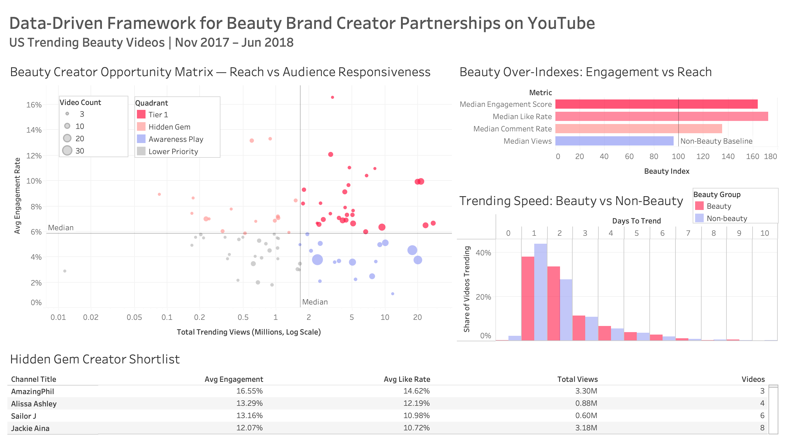

# Data-Driven Framework for Beauty Brand Creator Partnerships on YouTube


## Business Problem

Beauty brands investing in YouTube influencer partnerships typically evaluate creators using reach (views), subscriber count or trending frequency. The assumption is that larger audiences produce better campaign outcomes. Findings are directional and based on historical data. See the notebook for methodology, assumptions and limitations.

This project challenges that assumption. Reach and audience engagement are not interchangeable metrics and prioritising one over the other can change which creators make the shortlist. For a brand where audience responsiveness, trust, and active participation drive campaign outcomes, optimising for views alone is likely leaving value on the table.


## Project Objective

Identify which YouTube creators a beauty brand should prioritise for partnerships, using audience responsiveness as the primary selection criterion rather than raw reach and demonstrate how that shift produces a different, more strategically valuable creator shortlist.


## Dataset

**Source:** [Kaggle — Trending YouTube Video Statistics](https://www.kaggle.com/datasets/datasnaek/youtube-new)

- ~40,900 trending records · 6,351 unique videos after deduplication
- Covers US YouTube trending data from November 2017 to June 2018
- Variables include: views, likes, dislikes, comments, publish date, category, channel

> **Note:** The raw dataset (`USvideos.csv`) is not included in this repository due to file size. Download it directly from the Kaggle link above and place it in the project root before running the notebook.

Findings are directional and based on historical data. See the notebook for methodology, assumptions, and limitations.


## Analytical Approach

The analysis moves from platform-wide context to beauty-specific decision support in a deliberate sequence:

1. **Data cleaning and feature engineering** — date parsing, deduplication, engagement metric construction (`engagement_score = (likes + comments) / views`), beauty classification via dual-criterion tagging (category + keyword matching), and performance tier segmentation
2. **Platform-wide EDA** — establishing that engagement and reach are nearly uncorrelated across all trending content, which is the empirical foundation for everything that follows
3. **Beauty content deep-dive** — indexed comparison of beauty vs non-beauty performance, creator-level aggregation, and the opportunity matrix separating creators by reach and engagement
4. **Performance segmentation** — behavioural differences across performance tiers, with a focus on engagement quality and viral speed rather than view volume
5. **SQL analysis** — six business-oriented queries executed in SQLite, covering category benchmarking, beauty creator ranking, hidden-gem identification, tier breakdown, and timing analysis
6. **Strategic recommendations** — three actionable decisions derived from the analysis: selection criteria, budget allocation structure, and campaign activation timing

`engagement_score` is used throughout as a proxy for audience responsiveness. The proxy logic and its limitations are addressed explicitly in the analysis.


## Key Findings

**Reach and engagement are nearly uncorrelated.**
Across trending videos, `engagement_score` shows close to zero correlation with raw view counts. A video with 10× more views does not reliably produce 10× more audience interaction.

**Beauty content over-indexes on engagement, not reach.**
Howto & Style sits mid-table on median views, ranking below Music and Entertainment. On median engagement score and like rate, it ranks near the top of all categories. Beauty audiences are active, not passive.

**Engagement rate decays modestly as beauty channels scale.**
Among beauty channels, higher total reach is associated with a modest decline in average engagement rate. Larger channels do not consistently generate the strongest audience engagement.

**A distinct group of hidden-gem creators sits above the engagement median while below the reach median.**
These channels deliver audience responsiveness comparable to much larger partners. If partnership pricing is primarily reach-driven — which it typically is — these creators are systematically undervalued.

**Viral momentum in beauty is front-loaded.**
Over 70% of trending beauty videos reach the trending page within two days of publishing. Viral-tier videos sustain trending position roughly twice as long as lower-tier content. The first 48 hours after upload are the highest-leverage window for brand amplification.


## Strategic Recommendations

**1. Restructure creator selection around engagement, not views**
A shortlist built on subscriber count or total views will systematically exclude creators with the most responsive audiences. `engagement_score` is the more commercially relevant primary criterion for any campaign where audience interaction matters more than impression volume. The SQL queries in this project provide a reusable evaluation template.

**2. Adopt a two-tier partnership strategy**
- **Tier 1 (Reach):** A small number of large beauty creators for brand awareness campaigns where impression volume is the primary objective
- **Tier 2 (Hidden Gems):** Mid-sized creators with above-median engagement and below-median reach. These creators may represent overlooked partnership opportunities, as their engagement performance appears stronger than their reach alone would indicate.
**3 — Treat the 48-hour post-upload window as the critical activation moment**
Beauty content reaches the trending page quickly, with most trending videos appearing within two days of publication. Campaign activities such as paid promotion, cross-channel sharing, and PR outreach should therefore be planned around this early visibility window. While the analysis does not establish a causal link between amplification and trending success, it suggests that audience traction is largely established during the first 48 hours. Videos demonstrating strong early momentum may be prioritised for additional campaign investment, rather than waiting for final performance outcomes.


## Tableau Dashboard

The dashboard operationalises the project's analytical outputs into a single decision-support view for a beauty brand's partnerships or marketing team.

The dashboard supports interactive exploration of creator performance, engagement quality, and trending behaviour.



**Four components:**

| Component | Purpose |
|---|---|
| **Creator Opportunity Matrix** | Scatter plot mapping all qualifying beauty creators by total reach (X) and avg engagement rate (Y), with quadrant classification. The visual highlights creator positioning relative to the hidden-gem threshold and partnership opportunity framework. |
| **Beauty Over-Indexes: Engagement vs Reach** | Indexed bar chart comparing beauty vs non-beauty across four metrics (views, like rate, engagement score, comment rate), with non-beauty = 100 as the baseline. States the core thesis in one chart. |
| **Trending Speed: Beauty vs Non-Beauty** | Distribution of days-to-trend for beauty and non-beauty content. Visualises the front-loaded 48-hour viral window. |
| **Hidden Gem Creator Shortlist** | Ranked table of hidden-gem creators ordered by average engagement rate. The table converts the analysis into a practical shortlist for creator partnership evaluation. |


## Tools Used

| Tool | Purpose |
|---|---|
| Python 3 | Core analysis environment |
| pandas | Data manipulation and aggregation |
| NumPy | Feature engineering and numerical computation |
| Matplotlib / Seaborn | Data Visualisation |
| SQLite3 | SQL-based analysis within the notebook |
| Tableau Public | Interactive dashboard development |
| Jupyter Notebook | Analysis and narrative environment |


## Repository Structure

```
ํYouTube-Beauty-Creator-Analysis/

├── README.md
│   └── Project overview, key findings, and business recommendations
│
├── Data-Driven_Framework_for_Beauty_Brand_Creator_Partnerships_on_YouTube.ipynb
│   └── Complete analysis notebook from data preparation to strategic recommendations
│
├── dashboard/
│   ├── Youtube_Beauty_Strategy_Dashboard.twbx
│   └── Tableau_Dashboard.png
│
├── charts/
│   ├── 04_views_distribution.png
│   ├── 04_category_performance.png
│   ├── 05_hidden_gem_matrix.png
│   ├── 05_days_to_trend.png
│   └── ...
│
└── US_category_id.json
    └── YouTube category mapping file
```


## Key Takeaways

This project demonstrates that creator evaluation becomes more informative when reach, engagement quality, and trending behaviour are considered together rather than in isolation. Each metric captures a different aspect of creator performance, and relying on a single measure risks overlooking potentially valuable partnership opportunities.

The analysis also highlights the importance of separating audience size from audience responsiveness. Within the beauty category, creator scale alone was not a consistent indicator of engagement performance, suggesting that partnership decisions benefit from a broader evaluation framework than reach-based ranking alone.

Although the findings are based on historical YouTube data, the underlying methodology remains transferable. The framework developed here can be applied to current creator data to support partnership selection, budget allocation, and campaign planning, while producing an updated shortlist tailored to the objectives of a specific campaign.